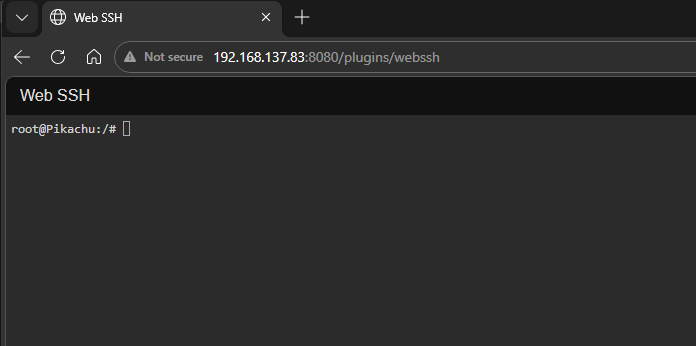

This plugin is designed to work with jayofelony Pwnagotchi 2.9.5.4

# Pwnagotchi Web SSH Setup (Step by Step)

This guide walks through setting up browser-based SSH in the Pwnagotchi Web UI using:

- `webssh.py` plugin (this repo)
- `ttyd` terminal server (on the Pwnagotchi)

## Prerequisites

1. You can already SSH into your Pwnagotchi from your computer.
2. Your Pwnagotchi Web UI loads at `http://YOUR_PWNAGOTCHI_IP:8080`.
3. This repo files are available on your computer.

## 1) Copy Plugin File to Pwnagotchi

From your computer, copy `webssh.py` to your device:

```bash
scp webssh.py pi@YOUR_PWNAGOTCHI_IP:/tmp/webssh.py
ssh pi@YOUR_PWNAGOTCHI_IP "sudo mv /tmp/webssh.py /usr/local/share/pwnagotchi/custom-plugins/webssh.py"
```

## 2) Enable Plugin in config.toml

Open `/etc/pwnagotchi/config.toml` on the Pwnagotchi and add:

```toml
[main.plugins.webssh]
enabled = true
ttyd_url = "http://127.0.0.1:7681"
title = "Web SSH"
```

Notes:
- `127.0.0.1` is correct here.
- The plugin rewrites localhost for remote browsers automatically.

## 3) Install ttyd

On the Pwnagotchi:

```bash
sudo apt update
sudo apt install -y ttyd
which ttyd
```

Expected:

```text
/usr/bin/ttyd
```

## 4) Configure ttyd as a service (writable mode)

Use a systemd override so updates do not overwrite your settings:

```bash
sudo mkdir -p /etc/systemd/system/ttyd.service.d
sudo tee /etc/systemd/system/ttyd.service.d/override.conf >/dev/null <<'EOF'
[Service]
ExecStart=
ExecStart=/usr/bin/ttyd -W -i 0.0.0.0 -p 7681 -c pi:CHANGE_ME_STRONG_PASSWORD /bin/bash
EOF
```

Then apply and start:

```bash
sudo systemctl daemon-reload
sudo systemctl enable --now ttyd
sudo systemctl restart ttyd
```

## 5) Verify ttyd is listening

```bash
sudo ss -ltnp | grep 7681
```

Expected format:

```text
LISTEN ... 0.0.0.0:7681 ... users:(("ttyd",pid=...,fd=...))
```

If you see `127.0.0.1:7681`, remote browser access will fail.

## 6) Restart Pwnagotchi

```bash
sudo systemctl restart pwnagotchi
```


## 7) Troubleshooting


### B) Can open terminal but cannot type

Cause: ttyd started read-only.

Fix: ensure `-W` exists in `ExecStart`.

### C) `systemctl edit ttyd` says override is empty

That happens if nothing is saved. Use the `tee` command in Step 4 instead.

### D) Bash warning: `bash: /.cargo/env: No such file or directory`

Run:

```bash
grep -nE "cargo/env|/.cargo/env|.cargo/env" /root/.bashrc /root/.profile 2>/dev/null
sudo sed -i 's|^[[:space:]]*\.[[:space:]]*"\$HOME/\.cargo/env"[[:space:]]*$|[ -f "\$HOME/.cargo/env" ] \&\& . "\$HOME/.cargo/env"|' /root/.bashrc /root/.profile
sudo systemctl restart ttyd
```

## Security Recommendations

1. Change `CHANGE_ME_STRONG_PASSWORD` to a strong unique password.
2. Do not expose port `7681` directly to the public internet.
3. Keep access limited to trusted local network devices.

## Quick Health Check Commands

```bash
sudo systemctl status ttyd --no-pager
sudo systemctl status pwnagotchi --no-pager
sudo ss -ltnp | grep -E "7681|8080|8081"
```
